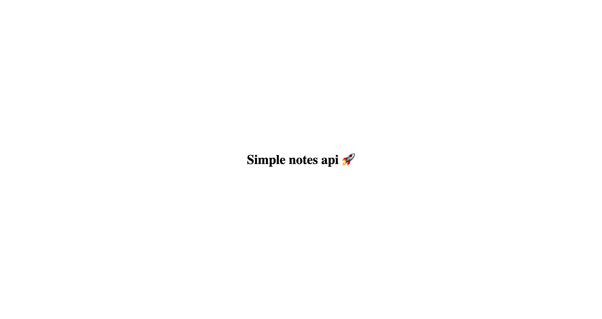

## Simple Notes - Backend
<!-- 
 -->



**This personal project was initiated in early 2021 to showcase the skills and implementations I had at that time as backend developer.** It's a simple note api organized by tags. While not actively supported, it reflects my past abilities.

Reviewing the code in 2023, I realize there are many things to improve. This is the first version. Check out Version 3, "Royal Palace" for significant upgrades and don't require api.


## How to run this project

To install this repository, run:
```bash
npm run install
```

Then set up a mongo Db database, I recommend you to use: [MongoDB Atlas](https://www.mongodb.com/atlas/database])

Then setup the `.env` file, make a copy from `.env.example` and set up the variables:
```bash
USER_DB=       //<--- user from mongo db
PASSWORD_DB=   //<--- password from mondo db 
```

then run on localhost:
```bash
npm run dev
```

Now you have running the api on http://localhost:4000

## ## routes

### /auth
```
POST: /api/v1/auth/sign-up
POST: /api/v1/auth/sign-in
```

### /user
```
POST: /api/v1/user
GET: /api/v1/user
GET: /api/v1/user/:id
PUT /api/v1/user/:id
DELETE /api/v1/user/:id
```

### /tag
```
POST: /api/v1/tag
GET: /api/v1/tag/user/:user
GET: /api/v1/tag/:id
PUT: /api/v1/tag/:id
DELETE: /api/v1/tag/:id
```

### /notes
```
POST: /api/v1/note
GET: /api/v1/note/user/:user
GET: /api/v1/note/:id
PUT: /api/v1/note/:id
DELETE: /api/v1/note/:id
```


## License

This project is licensed under the MIT License - see the [LICENSE](LICENSE) file for more details.

## Contact
If you have questions, get in touch with Jimy at **dev.jimynicanor@gmail.com**.